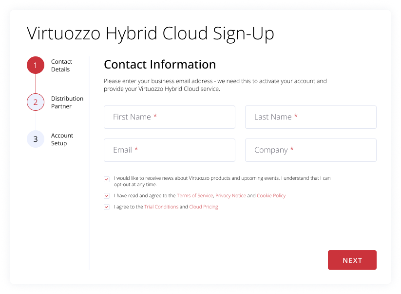

# Virtuozzo Hybrid Cloud Registration Widget

Virtuozzo Hybrid Cloud Registration Widget is an interactive tool for automated registration. It is based on the standard HTML, JS, and CSS technologies supported by all modern browsers, which ensures easy installation on any page without any additional requirements. Also, the initialization is performed in the background and does not affect the page loading speed.


## Add Widget to Website

Widget addition to your site can be accomplished in a few simple steps:

1. All the required scripts and styles for the hybrid cloud registration widget are stored in the dedicated `vhc-signup` directory. You can get this folder from this repository. For example, with the following command:

    ```bash
    git clone https://github.com/virtuozzo/vhc-registration-widget
    ```

    > **Tip:** If you want to [customize the widget appearance](#customize-widget-layout), refer to the linked section and adjust files within the directory based on your needs.

2. Add the `vhc-signup` folder downloaded in the previous step to your site's root folder. Next, insert the following lines between the `<head>` and `</body>` tags for each page with the registration widget:

    ```html
    <script src="{siteUrl}/vhc-signup/js/plugins/jquery-3.7.1.min.js"></script>
    <script src="{siteUrl}/vhc-signup/js/vhc-signup-widget.min.js"></script>
    <link rel="stylesheet" href="{siteUrl}/vhc-signup/css/vhc-signup-widget.min.css">
    ```
   Don’t forget to correctly substitute the ***{siteUrl}*** placeholder.

3. Now, insert the following block at the position where the widget should be displayed:

    ```html
    <div class=“vhc-signup-widget” data-key=“{distributor_key}“></div>
    ```

    Replace the ***{distributor_key}*** placeholder with a value from the [distributors](https://virtuozzo.com/vhc-signup/distributors.js) page.

The default ready-to-work hybrid cloud signup widget looks as follows:




## Customize Widget Layout

If needed, the widget can be fully customized to match your particular needs and unique branding. The project is built based on the **Gulp** with [SCSS](https://sass-lang.com/) preprocessor, which provides access to the following features:

- compile sass with libsass
- lint and minify scripts
- image optimization

In order to perform customization to the project, you’ll need a [Node.js](https://nodejs.org/) server version 6 or higher.

1. Install the [Gulp](https://gulpjs.com/) utility with the following command:

    ```bash
    npm install gulp --global
    ```

2. Next, if you haven't before, clone the widget repository.

    ```bash
    git clone https://github.com/virtuozzo/vhc-registration-widget
    ```

3. Move inside the project folder and install dependencies.

    ```bash
    cd vhc-registration-widget
    npm install -d   
    ```

4. Start a server with the `gulp` command to preview changes.

    ```bash
    gulp
    ```

5. You can change CSS in the __assets/scss/*.scss__ file. For example, try adjusting the following default variables:

    ```scss
   $tablet: 992px;
   $mobile: 768px;
   $extraSmall: 475px;
   $mainColor: #cb333b;
   $hoverColor: #9B2637;
    ```

6. Once you are satisfied with the results, build the production environment.

    ```bash
    gulp default
    ```

   In a moment, you will have the following files in the vhc-signup folder:

    - __index.html__ - example with widget initialization selector
    - __vhc-signup-widget.min.js__ - minified JavaScript
    - __vhc-signup-widget.min.css__ - minified CSS

   Use these files instead of the default ones during the [widget addition](#add-widget-to-website) to your website page.

7. Additionally, for the best performance, some images are saved in the SVG format. Non-converted images can be located in the __assets/img/__ folder.

Now, you have all the required information to customize (if needed) and integrate the Virtuozzo Hybrid Cloud Registration Widget into your website.
